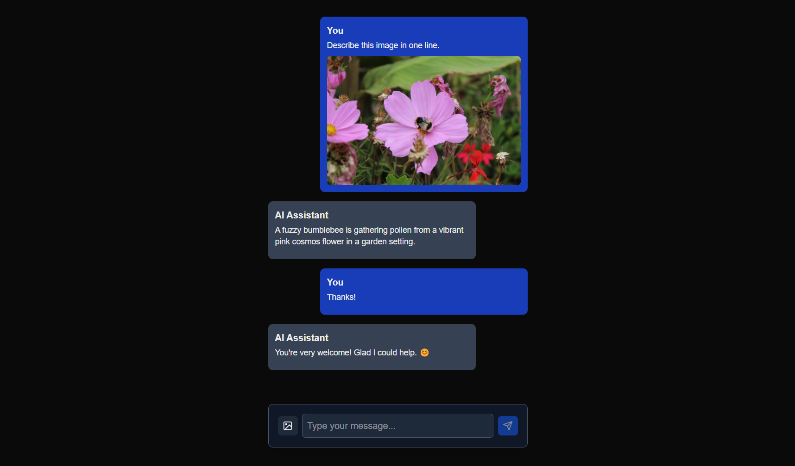

# NextJS-Hugging Face

This Next.js project makes use of Hugging Face [inference providers](https://huggingface.co/docs/inference-providers/en/index) in OpenAI-compatible mode to access various [multimodal models](https://huggingface.co/models?inference_provider=all&pipeline_tag=image-text-to-text). It serves as a simple example of utilizing these inference providers alongside the [Vercel AI SDK](https://sdk.vercel.ai/) to create a multimodal chatbot that interacts with users through text and images. The project is designed to be easy to set up and run locally, making it a great starting point for developers looking to explore the capabilities of Hugging Face models in a Next.js environment.

Below is a screenshot of the application in action:



## Project Structure

The project is structured as follows:

- `assets/`: This directory contains screenshots of the output responses.

- `public/`: Static assets like SVG icons and images used in the application.

- `app/`: Main application directory.

  - `globals.css`: Global stylesheet for the application.
  - `layout.tsx`: Root layout for the application.
  - `page.tsx`: Main page for the application.

  - `api/chat/`: Directory for API routes.
    - `route.ts`: API endpoint for handling chat requests with multimodal capabilities.

- `.gitignore`: Specifies which files and directories should be ignored by Git.
- `LICENSE`: Project licensing information.
- `README.md`: Project documentation and setup instructions.
- `package.json`: Project dependencies and script configuration.

## Technologies Used

- **TypeScript**: Superset of JavaScript that adds static types to the language.
- **Tailwind CSS**: Utility-first CSS framework for styling web applications.
- **Next.js**: React framework for building user interfaces.
- **Hugging Face**: AI model hub for accessing the multimodal model.
- **Vercel AI SDK**: TypeScript toolkit designed to build AI applications using popular frameworks like Next.js, React, and runtimes like Node.js.

## Getting Started

To get started with this project, follow the steps below:

1. Clone the repository: `git clone https://github.com/sitamgithub-MSIT/nextjs-huggingface.git`
2. Change the directory: `cd nextjs-huggingface`
3. Install the required dependencies: `npm install`
4. Run the application: `npm run dev`

**Note**: You need a Hugging Face access token to run the application. You can get the token by signing up on the Hugging Face website and creating a new token from the settings page. After getting the token, you can set it as an environment variable `HF_TOKEN` in your system by creating a `.env.local` file in the project's root directory. Replace the values with your API key.

```bash
HF_TOKEN=your_token_here
```

Open your local host to view the web application in your browser at `http://localhost:3000/`.

## Deployment

To deploy this application to a production environment, you can follow the [Vercel YouTube video](https://www.youtube.com/watch?v=AiiGjB2AxqA). Once the application is deployed, you can access it at a live URL.

To deploy this application to Hugging Face Spaces, you can do this by selecting the Spaces SDK as Docker when creating a new Space. Create a `Dockerfile` in the root directory of the project and set the following content:

```dockerfile
# Use Node 22 as the base image
FROM node:22-alpine

# Set the working directory inside the container
WORKDIR /app

# Copy package.json and package-lock.json (if you have one)
COPY package*.json ./

# Install dependencies
RUN npm install

# Copy the rest of the application code
COPY . .

# Expose the port your React app runs on
EXPOSE 7860

# Change ownership of /app to the node user
RUN chown -R node:node /app

# Switch to the node user
USER node

# Command to run the application
CMD ["npm", "run", "dev"]
```

**Note**: Make sure to set the `HF_TOKEN` environment variable in your deployment settings.

## Usage

Once running (locally in development mode using `npm run dev`), open your browser and navigate to http://localhost:3000/.

- Chat Interface: The main page presents a multi-modal chat interface. Users can send text messages and attach images.
- Image Upload: When attaching images, previews are displayed for each uploaded image. You can remove any selected image before sending your message.
- Chat Interaction: The chat uses Hugging Face’s inference provider with the AI chat model to return responses with text and image attachments.

### Changing the Model

To change the model used in the application, you can modify the `route.ts` file located in the `app/api/chat/` directory. You can choose any other compatible Hugging Face model with inference providers options. You can find a list of available models on the [Hugging Face Model Hub](https://huggingface.co/models?inference_provider=all&pipeline_tag=image-text-to-text).

```typescript
// Get the response from the model
const result = streamText({
  model: model("google/gemma-3-27b-it"),
  messages: messages,
  maxTokens: 500,
  experimental_transform: smoothStream(),
});
```

To change the model, replace `google/gemma-3-27b-it` with other models that satisfy the inference provider options in Hugging Face.

## Results

When the application is running, users will encounter a responsive chat interface that uses a Hugging Face model to generate AI responses to text and image uploads. Image previews are shown before submission, and responses may include text and images. This setup demonstrates how traditional chat interfaces can be enhanced with multimodal capabilities. For results, please refer to the `assets/` directory for screenshots that illustrate the chat interface in action.

## Contributing

Contributions are welcome! If you would like to contribute to this project, please raise an issue to discuss the changes you would like to make. Once the changes are approved, you can create a pull request.

## License

This project is licensed under the MIT License. See the [LICENSE](LICENSE) file for more details.

## Contact

If you have any questions or suggestions regarding the project, feel free to reach out to me on my GitHub profile.

Happy coding! 🚀
